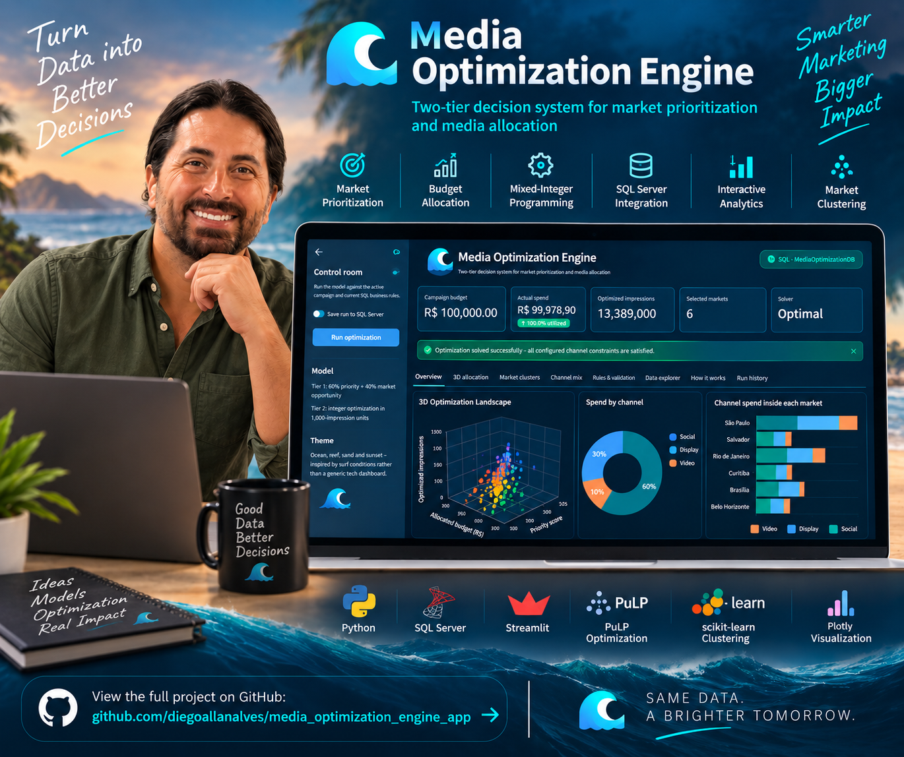

# Media Optimization Engine

A portfolio-ready two-tier media optimization application built with Python, SQL Server, PuLP and Streamlit.

## Architecture

`SQL Server → Tier 1 Heuristic → Tier 2 MIP → Validation → SQL Results → Streamlit`

### Tier 1 — Market prioritization
The heuristic combines 60% business priority with 40% potential impressions, selects markets within the campaign's minimum/maximum market rules, then allocates budget while respecting each market's budget bounds.

### Tier 2 — Media optimization
A Mixed-Integer Programming (MIP) model maximizes impressions within each selected market. Integer variables represent 1,000-impression units and binary variables activate inventory lines. Constraints cover market budget, available inventory, minimum purchases, and channel-share business rules loaded from SQL Server.

## Dashboard
The Streamlit application includes campaign KPIs, market allocation charts, an interactive 3D optimization landscape, real K-Means market clustering, channel mix, constraint validation, allocation filters/downloads, methodology notes, and saved-run history.

The visual system uses a restrained surf-inspired palette: ocean, reef, sand and sunset accents.

## Setup
1. Use SQL Server database `MediaOptimizationDB` with the existing `Markets`, `MediaInventory`, `Campaigns`, and `ChannelConstraints` tables.
2. If result tables do not exist, run `sql/07_optimization_results.sql` in SSMS.
3. Create/activate a virtual environment.
4. Install dependencies: `pip install -r requirements.txt`
5. Test: `python database.py`
6. Test Tier 1: `python heuristic.py`
7. Test Tier 2: `python mip_optimizer.py`
8. Save a run: `python optimization_service.py`
9. Launch: `streamlit run app.py`

## Important
`database.py` currently uses Windows Authentication and the local SQL Server instance `LAPTOP-HSERDTUR\\SQLEXPRESS`. Change `SERVER` if the project is run on another computer.

## Bug-fix release
This version intentionally preserves the original Surf Portfolio charts and dashboard structure.
Fixes only:
- Streamlit 2026 `width="stretch"` migration.
- Removed the white header container.
- Fixed dark-mode text contrast, including sidebar controls and Streamlit popover/menu text.
- Changed the original 3D chart scene from washed-out white to a deep-ocean scene.
